# 📊 Experiment 16 – Basic Charts and Visual Encoding using Python

<div align="center">


</div>

---

## 🎓 Student Information

| Field | Details |
|-------|---------|
| **Name** | Tanmay Agarwal |
| **PRN** | 25070123158 |
| **Branch / Batch** | EnTC A3 |
| **Experiment No.** | 16 |
| **Subject** | Exploratory Data Analysis (EDA) |
| **Date** | 08 / 04 / 2026 |
| **Title** | Basic Charts and Visual Encoding |

---

## 🎯 Aim of the Experiment

> To study and implement **basic charts and visual encoding techniques** using Python libraries — Matplotlib and Seaborn — by plotting Line Charts, Bar Charts, Histograms, Pie Charts, Scatter Plots, and Box Plots on real-world structured datasets, and to understand how data is visually encoded through position, color, size, and shape.

---

## 📖 Introduction

Data analysis is not limited to numbers and tables. The human brain processes visual information far more efficiently than raw data. **Data Visualization** is the bridge between raw data and meaningful insight — it transforms complex numerical datasets into intuitive, visually understandable formats.

In this experiment, we explore the foundational techniques of **Basic Charts and Visual Encoding** using Python. We work with two custom datasets — a **Student Performance Dataset** and a **Retail/Sales Dataset** — and apply various chart types to reveal hidden patterns, trends, distributions, and comparisons.

Python offers powerful open-source libraries like **Matplotlib** and **Seaborn** that make it easy to produce publication-quality plots with minimal code. Together, these tools give data analysts the ability to:

- Quickly explore the structure of a dataset
- Identify outliers, trends, and distributions
- Compare variables across multiple categories
- Communicate findings clearly and effectively

This experiment covers not only the mechanics of plotting but also the **theory of visual encoding** — how visual properties like color, position, and size carry data meaning — making it an essential foundation for any data science or analytics workflow.

---

## 📌 About Data Visualization

### 🔹 What is Data Visualization?

**Data Visualization** is the graphical representation of information and data using visual elements such as charts, graphs, maps, and infographics. It provides an accessible way to see and understand trends, outliers, and patterns in data.

Rather than reading through rows of numbers in a spreadsheet, a well-constructed chart conveys the same information instantly. Visualization is both a **science** (choosing the right chart type, using accurate scales) and an **art** (designing readable, aesthetically pleasing outputs).

### 🔹 Why is Data Visualization Important?

- **Faster Decision Making** — Visual patterns are recognized in milliseconds compared to scanning tables
- **Pattern Discovery** — Relationships and trends that are invisible in raw data become obvious in charts
- **Storytelling with Data** — Visualization enables data-driven narratives for reports and presentations
- **Outlier Detection** — Anomalies stand out immediately in a scatter plot or box plot
- **Communication** — Non-technical stakeholders can understand insights without reading raw numbers
- **Hypothesis Generation** — Visual exploration often sparks new analytical questions

### 🔹 Real-World Usage of Data Visualization

| Domain | Application |
|--------|------------|
| 🏥 Healthcare | Patient monitoring dashboards, disease outbreak maps |
| 📈 Finance | Stock market trend lines, portfolio performance charts |
| 🛒 Retail | Sales heatmaps, customer segmentation plots |
| 🎓 Education | Student performance tracking, attendance analytics |
| 🌦️ Meteorology | Weather pattern plots, climate change graphs |
| 🏭 Manufacturing | Quality control charts, production output histograms |
| 🌐 Social Media | Engagement trend lines, sentiment analysis word clouds |

---

## 📚 About Libraries Used

### 🔹 Matplotlib

**Matplotlib** is the foundational plotting library in Python, built on top of NumPy. It was created by **John D. Hunter** in 2003 and has since become the most widely used visualization library in the Python ecosystem.

**Key Features:**
- Produces publication-quality 2D plots in various formats (PNG, SVG, PDF)
- Highly customizable — control every visual element (axes, ticks, fonts, colors)
- Supports both **object-oriented** and **MATLAB-style (pyplot)** interfaces
- Works seamlessly with NumPy arrays and Pandas DataFrames
- Capable of building complex multi-panel figures using `plt.subplots()`

**Primary Interface — `pyplot`:**
```python
import matplotlib.pyplot as plt
```

The `pyplot` module provides a collection of functions that make Matplotlib work like MATLAB, with each function making some change to a figure (e.g., creates a figure, creates a plot area in a figure, plots some lines in a plot area, decorates the plot with labels, etc.).

**Why Matplotlib?**
- Industry standard for Python visualization
- Extensive documentation and community support
- Fine-grained control over every aspect of the figure
- Foundation for many other libraries (Seaborn, Pandas plotting)

---

### 🔹 Seaborn

**Seaborn** is a high-level data visualization library built **on top of Matplotlib**. It provides a cleaner, more concise API for creating statistically informative and aesthetically pleasing plots.

**Key Features:**
- Beautiful default themes and color palettes
- Built-in support for Pandas DataFrames
- Statistical plot types: KDE plots, violin plots, pair plots, heatmaps
- Automatic aggregation and error-bar computation
- Easy categorical plot types with `hue`, `col`, and `row` parameters

```python
import seaborn as sns
```

**Why Seaborn?**
- Produces complex statistical visualizations with minimal code
- Ideal for exploratory data analysis (EDA)
- Handles groupby-style operations automatically (no need to manually aggregate)
- Seamlessly integrates with Pandas DataFrames

---

### 🔹 Supporting Libraries

| Library | Role in This Experiment |
|---------|------------------------|
| `pandas` | Data loading, manipulation, and DataFrame handling |
| `numpy` | Numerical computations, array generation for plotting |

---

## 📊 Types of Charts

### 1️⃣ Line Chart

**Definition:**
A Line Chart displays data points connected by straight line segments. It is the most common chart type for showing **trends over time** or continuous data where the sequence of values matters.

**When to Use:**
- Visualizing trends over time (daily, monthly, yearly)
- Comparing multiple continuous variables on the same axis
- Showing the rate of change between data points

**Syntax Example:**
```python
plt.figure(figsize=(8, 4))
plt.plot(df['Days'], df['Study_Hours'], marker='o', color='blue', label='Study Hours')
plt.plot(df['Days'], df['Marks'], marker='s', color='orange', label='Marks')
plt.title('Study Hours and Marks Trend')
plt.xlabel('Days')
plt.ylabel('Value')
plt.legend()
plt.grid(True, linestyle='--', alpha=0.5)
plt.show()
```

**Key Parameters:**

| Parameter | Description |
|-----------|-------------|
| `marker` | Symbol at each data point (`'o'`, `'s'`, `'^'`, `'*'`, `'x'`) |
| `color` | Line color (e.g., `'blue'`, `'#FF6B6B'`) |
| `linestyle` | Style of line (`'-'`, `'--'`, `':'`, `'-.'`) |
| `linewidth` | Thickness of the line |
| `label` | Legend label for this line |

---

### 2️⃣ Bar Chart

**Definition:**
A Bar Chart uses rectangular bars of proportional height (or length) to represent the values of categorical data. Each bar corresponds to one category, and the bar's length/height represents its value.

**When to Use:**
- Comparing discrete categories (e.g., marks per subject, sales per region)
- Showing rankings or relative magnitudes
- Grouped bars for comparing subcategories side by side

**Syntax Example — Vertical Bar Chart:**
```python
plt.figure(figsize=(7, 4))
plt.bar(df['Days'], df['Marks'], color='steelblue', edgecolor='black', width=0.5)
plt.title('Marks per Day (Bar Chart)')
plt.xlabel('Days')
plt.ylabel('Marks')
plt.show()
```

**Syntax Example — Grouped Bar Chart:**
```python
x = np.arange(len(df['Days']))
width = 0.25
plt.bar(x - width, df['Study_Hours'], width=width, label='Study Hours', color='royalblue')
plt.bar(x,         df['Marks'],       width=width, label='Marks',        color='tomato')
plt.bar(x + width, df['Sleep_Hours'], width=width, label='Sleep Hours',  color='seagreen')
plt.xticks(x, df['Days'])
plt.legend()
plt.show()
```

**Syntax Example — Horizontal Bar Chart:**
```python
plt.barh(df['Days'], df['Marks'], color='mediumpurple', edgecolor='black')
plt.title('Marks per Day (Horizontal Bar)')
plt.show()
```

---

### 3️⃣ Histogram

**Definition:**
A Histogram divides a continuous variable into equal-width **bins** and plots the frequency (count) of observations that fall into each bin. It is used to visualize the **distribution** of a single numerical variable.

**When to Use:**
- Exploring the frequency distribution of a continuous variable
- Detecting skewness, modality (unimodal vs. bimodal), and spread
- Identifying outliers or unusual patterns in data distribution

**Syntax Example:**
```python
plt.figure(figsize=(7, 4))
plt.hist(df['Marks'], bins=5, color='salmon', edgecolor='black', alpha=0.8)
plt.axvline(df['Marks'].mean(), color='darkred', linestyle='--', label='Mean')
plt.title('Distribution of Marks (Histogram)')
plt.xlabel('Marks')
plt.ylabel('Frequency')
plt.legend()
plt.show()
```

**Key Parameters:**

| Parameter | Description |
|-----------|-------------|
| `bins` | Number of intervals (more bins = finer detail) |
| `edgecolor` | Border color of each bar |
| `alpha` | Transparency (0 = fully transparent, 1 = opaque) |
| `density` | If `True`, normalizes to show probability density |

---

### 4️⃣ Pie Chart

**Definition:**
A Pie Chart is a circular statistical graphic divided into **slices** that represent the proportional contribution of each category to the whole (100%). Each slice's arc length is proportional to the quantity it represents.

**When to Use:**
- Showing the part-to-whole relationship
- Comparing the relative proportion of a small number of categories (ideally fewer than 6)
- When the total is more meaningful than individual differences

**Syntax Example:**
```python
plt.figure(figsize=(6, 6))
labels = df['Days']
values = df['Marks']
explode = (0.1, 0, 0, 0, 0)

plt.pie(values, labels=labels, autopct='%1.1f%%', explode=explode,
        startangle=90, shadow=True,
        colors=['#FF6B6B','#4ECDC4','#45B7D1','#96CEB4','#FFEAA7'])
plt.title('Marks Distribution by Day (Pie Chart)')
plt.show()
```

---

### 5️⃣ Scatter Plot

**Definition:**
A Scatter Plot displays values for **two numerical variables** as points on a two-dimensional plane. Each point's horizontal position represents one variable and its vertical position represents the other, making relationships and correlations visually apparent.

**When to Use:**
- Exploring the relationship or correlation between two continuous variables
- Identifying clusters, outliers, and data density patterns
- Visualizing multi-variable data using color (hue) and size as additional dimensions

**Syntax Example:**
```python
plt.figure(figsize=(7, 4))
plt.scatter(df['Study_Hours'], df['Marks'],
            c=df['Attendance'], cmap='viridis',
            s=100, edgecolors='black', alpha=0.8)
plt.colorbar(label='Attendance')
plt.title('Study Hours vs Marks (Color = Attendance)')
plt.xlabel('Study Hours')
plt.ylabel('Marks')
plt.show()
```

**Key Parameters:**

| Parameter | Description |
|-----------|-------------|
| `c` | Color array (can map a third variable) |
| `cmap` | Color map for mapping numeric values to colors |
| `s` | Size of each point |
| `alpha` | Transparency of points |

---

### 6️⃣ Box Plot

**Definition:**
A Box Plot (also called a **Box-and-Whisker Plot**) summarizes a dataset's distribution using five statistics: **minimum**, **Q1 (25th percentile)**, **median (Q2)**, **Q3 (75th percentile)**, and **maximum**. Outliers are plotted individually beyond the whiskers.

**When to Use:**
- Comparing distributions across multiple groups or categories
- Detecting outliers and the spread of data (IQR)
- Understanding skewness of a distribution at a glance

**Syntax Example:**
```python
plt.figure(figsize=(7, 4))
plt.boxplot([df['Study_Hours'], df['Sleep_Hours']],
            tick_labels=['Study Hours', 'Sleep Hours'],
            patch_artist=True,
            boxprops=dict(facecolor='lightblue', color='navy'))
plt.title('Study Hours vs Sleep Hours Distribution')
plt.ylabel('Hours')
plt.show()
```

**Reading a Box Plot:**

```
         |-----|        <-- Whisker (Max or 1.5×IQR)
         |     |
    _____|_____|_____
   |     Q1  Med Q3  |   <-- Box (Interquartile Range)
   |_________________|
         |     |
         |-----|        <-- Whisker (Min or 1.5×IQR)
           ○             <-- Outlier (beyond 1.5×IQR)
```

---

## 🎨 Visual Encoding

### 🔹 What is Visual Encoding?

**Visual Encoding** is the technique of mapping data values to visual properties of graphical elements. Instead of conveying data through numbers, visual encoding lets viewers perceive data relationships intuitively — through the human visual system's pre-attentive processing.

Every chart is essentially a set of visual encoding decisions:
- _Which variable goes on the X-axis?_
- _What color represents which category?_
- _Should size represent magnitude?_

Choosing the right encoding for the right data type dramatically improves the readability and insight-delivery of a visualization.

---

### 🔹 Core Visual Encoding Channels

#### 📍 Position

**Position** is the most powerful and accurate encoding channel. The location of a mark on the X or Y axis directly encodes a quantitative value.

- In a **scatter plot**, X and Y positions encode two continuous variables simultaneously
- In a **bar chart**, the height (Y position) encodes the magnitude of a category
- In a **line chart**, the Y position at each X point encodes the value over time

```python
# Position encoding: x = Study_Hours, y = Marks
plt.scatter(df['Study_Hours'], df['Marks'])
```

> ✅ Best for: **Quantitative data** — viewers can accurately compare values by position

---

#### 🎨 Color

**Color** is used to encode **categorical** distinctions or **sequential/diverging** quantitative values.

- **Categorical color palettes** (e.g., `'Set2'`, `'tab10'`): Different hues for different groups
- **Sequential color maps** (e.g., `'viridis'`, `'Blues'`): Gradients encode magnitude (low → high)
- **Diverging color maps** (e.g., `'RdBu'`, `'coolwarm'`): Encode values on either side of a midpoint

```python
# Color encodes a third variable (Attendance)
plt.scatter(df['Study_Hours'], df['Marks'], c=df['Attendance'], cmap='plasma')
```

> ✅ Best for: **Nominal/categorical grouping** or **continuous magnitude on sequential scales**

---

#### 📏 Size

**Size** (area or radius of a mark) encodes **quantitative magnitude** — larger marks represent larger values. Commonly used in bubble charts.

```python
# Size encodes Assignment_Completed count
plt.scatter(df['Study_Hours'], df['Marks'],
            s=df['Assignment_Completed'] * 100)
```

> ✅ Best for: **Quantitative data** where relative magnitude needs emphasis

---

#### 🔷 Shape

**Shape** encodes **categorical** identity — different symbols (circle, square, triangle, star) represent different groups.

```python
# Shape encoding using different markers per category
markers = {'Low': 'o', 'Medium': 's', 'High': '^'}
for group, marker in markers.items():
    subset = df[df['Category'] == group]
    plt.scatter(subset['X'], subset['Y'], marker=marker, label=group)
plt.legend()
```

> ✅ Best for: **Nominal categories** (up to ~6 distinct shapes are distinguishable)

---

### 🔹 Summary: How Charts Represent Data Visually

| Chart Type | Primary Encoding | Secondary Encoding |
|-----------|-----------------|-------------------|
| Line Chart | Position (X=time, Y=value) | Color (multiple lines) |
| Bar Chart | Length / Height | Color (categories) |
| Histogram | Length (bar height = frequency) | Color (bins) |
| Pie Chart | Angle / Area | Color (slices) |
| Scatter Plot | Position (X, Y) | Color, Size, Shape |
| Box Plot | Position (median, quartiles) | Color (groups) |

---

## 🛠️ Functions and Commands Reference Table

| Function / Command | Description |
|-------------------|-------------|
| `plt.plot(x, y)` | Plots a line chart connecting data points; supports `marker`, `color`, `linestyle`, `linewidth`, `label` parameters |
| `plt.bar(x, height)` | Draws a vertical bar chart; use `width`, `color`, `edgecolor`, `alpha` to customize |
| `plt.barh(y, width)` | Draws a horizontal bar chart; useful when category labels are long |
| `plt.hist(x, bins)` | Plots a histogram showing frequency distribution of a continuous variable |
| `plt.pie(x, labels)` | Creates a pie chart; use `autopct`, `explode`, `startangle`, `shadow` for enhancements |
| `plt.scatter(x, y)` | Creates a scatter plot; supports `c` (color), `s` (size), `cmap`, `alpha`, `edgecolors` |
| `plt.boxplot(data)` | Draws a box-and-whisker plot; use `tick_labels`, `patch_artist`, `boxprops` for styling |
| `plt.xlabel(label)` | Sets the label text for the X-axis |
| `plt.ylabel(label)` | Sets the label text for the Y-axis |
| `plt.title(title)` | Sets the main title of the current plot |
| `plt.legend()` | Displays the legend box based on `label` values set in plot commands |
| `plt.show()` | Renders and displays the current figure; always called last |
| `plt.figure(figsize)` | Creates a new figure with specified width × height in inches |
| `plt.subplots(r, c)` | Creates a grid of subplots with `r` rows and `c` columns |
| `plt.tight_layout()` | Automatically adjusts subplot spacing to prevent overlap |
| `plt.grid(True)` | Adds a background grid to the plot |
| `plt.axvline(x)` | Draws a vertical reference line at a specified X value |
| `plt.axhline(y)` | Draws a horizontal reference line at a specified Y value |
| `plt.colorbar()` | Adds a color scale bar (used with scatter plots mapping a third variable) |
| `plt.xticks(ticks, labels)` | Customizes tick positions and labels on the X-axis |
| `sns.lineplot()` | Seaborn: line plot with automatic confidence intervals |
| `sns.histplot()` | Seaborn: histogram with optional KDE overlay |
| `sns.scatterplot()` | Seaborn: scatter plot with `hue`, `size`, `style` grouping |
| `sns.boxplot()` | Seaborn: styled box plot by category using DataFrame columns |
| `sns.kdeplot()` | Seaborn: kernel density estimate plot for smooth distribution curves |
| `sns.pairplot()` | Seaborn: matrix of scatter/KDE plots for all variable pairs |
| `sns.heatmap()` | Seaborn: color-encoded matrix visualization (e.g., correlation matrix) |

---

## 🔢 Algorithm / Logic

The following step-by-step algorithm describes the general procedure followed for each chart in this experiment:

1. **Import Required Libraries**
   - Import `matplotlib.pyplot as plt` for core plotting
   - Import `seaborn as sns` for statistical visualizations
   - Import `pandas as pd` for dataset handling
   - Import `numpy as np` for numerical operations

2. **Define / Load the Dataset**
   - Create a structured dataset using `pd.DataFrame()`
   - Or load an external CSV using `pd.read_csv()`
   - Inspect data using `df.head()`, `df.dtypes`, `df.describe()`

3. **Select Variables for Plotting**
   - Identify the **independent variable** (X-axis) — typically categorical or time-based
   - Identify the **dependent variable** (Y-axis) — typically numerical
   - Optionally select a **grouping variable** for color/hue encoding

4. **Choose the Appropriate Chart Type**
   - Trend over time → **Line Chart**
   - Category comparison → **Bar Chart**
   - Distribution → **Histogram** or **Box Plot**
   - Proportions → **Pie Chart**
   - Correlation → **Scatter Plot**

5. **Initialize the Figure**
   - Call `plt.figure(figsize=(width, height))` to set canvas size
   - Or use `fig, axes = plt.subplots(rows, cols)` for multi-panel layouts

6. **Plot the Chart**
   - Call the appropriate plot function (e.g., `plt.plot()`, `plt.bar()`, `plt.scatter()`)
   - Pass the selected X and Y variables as arguments
   - Customize with `color`, `marker`, `edgecolor`, `alpha`, etc.

7. **Add Labels and Annotations**
   - Set X-axis label: `plt.xlabel('Label')`
   - Set Y-axis label: `plt.ylabel('Label')`
   - Set chart title: `plt.title('Title')`
   - Add legend (if multiple series): `plt.legend()`
   - Optionally add grid: `plt.grid(True, linestyle='--', alpha=0.5)`

8. **Apply Visual Encoding Enhancements**
   - Map a third variable to color (`c=`, `cmap=`) in scatter plots
   - Use `explode` in pie charts to highlight a slice
   - Use `patch_artist=True` in box plots for colored boxes

9. **Adjust Layout**
   - Call `plt.tight_layout()` to prevent overlapping elements

10. **Display the Visualization**
    - Call `plt.show()` to render and display the final chart

---

## 🗂️ Dataset Description

### 📋 Dataset 1 — Student Performance Dataset

A manually created dataset tracking a student's academic activity over one week.

| Column | Type | Description |
|--------|------|-------------|
| `Days` | Categorical | Day of the week (Mon–Fri) |
| `Study_Hours` | Float | Number of hours spent studying |
| `Marks` | Integer | Marks obtained in assessments |
| `Attendance` | Integer | Attendance percentage |
| `Sleep_Hours` | Integer | Hours of sleep per night |
| `Assignment_Completed` | Integer | Number of assignments submitted |

**Sample Data:**

| Days | Study_Hours | Marks | Attendance | Sleep_Hours | Assignment_Completed |
|------|-------------|-------|------------|-------------|----------------------|
| Mon  | 2.0         | 50    | 60         | 6           | 1                    |
| Tue  | 3.0         | 60    | 70         | 7           | 2                    |
| Wed  | 2.5         | 55    | 65         | 6           | 1                    |
| Thu  | 4.0         | 70    | 80         | 8           | 3                    |
| Fri  | 3.5         | 65    | 75         | 7           | 2                    |

---

### 📋 Dataset 2 — Monthly Performance Dataset

A second dataset covering monthly trends for broader EDA.

| Column | Type | Description |
|--------|------|-------------|
| `Month` | Categorical | Month name (Jan–Jun) |
| `Study_Hours` | Float | Hours studied per month |
| `Marks` | Integer | Average marks that month |
| `Attendance` | Integer | Monthly attendance % |
| `Sleep_Hours` | Float | Average sleep per night |
| `Assignment_Completed` | Integer | Assignments completed |

---

### 📋 Dataset 3 — Retail Sales Dataset

A more complex dataset simulating a retail environment with categorical and numerical variables.

| Column | Type | Description |
|--------|------|-------------|
| `Day` | Categorical | Day of the week |
| `Category` | Categorical | Product category (Food, Clothing, Electronics) |
| `Region` | Categorical | Geographic region (North, South, East, West) |
| `Sales` | Float | Total sales value |
| `Profit` | Float | Profit from the sales |
| `Customers` | Integer | Number of customers |
| `Rating` | Float | Customer satisfaction rating |

---

## 🖼️ Charts Output Section

### 📈 Dataset 1 — Matplotlib Charts

#### Chart 1 — Line Chart: Study Hours Trend

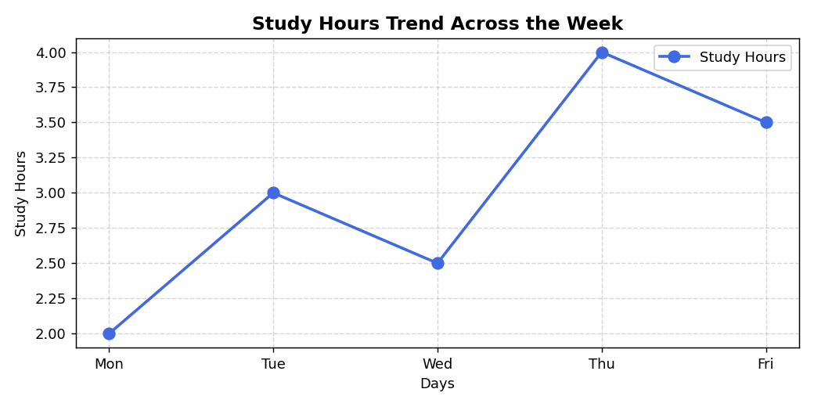

*Simple line chart showing how study hours vary across days of the week.*

---

#### Chart 2 — Advanced Line Chart: Study Hours & Marks Trend

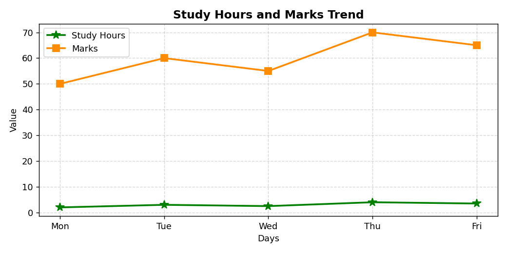

*Multi-line chart comparing Study Hours and Marks using different markers (`*` and `s`).*

---

#### Chart 3 — Vertical Bar Chart: Marks per Day

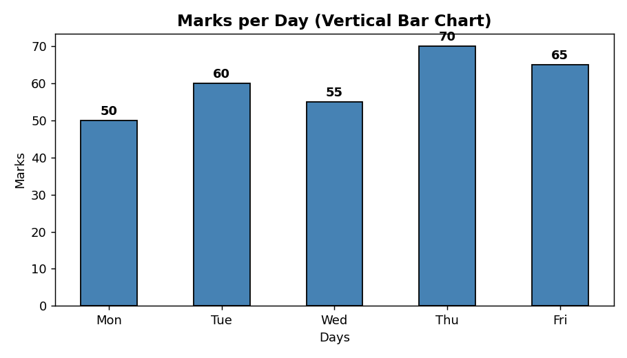

*Bar chart comparing marks scored each day; values annotated above each bar.*

---

#### Chart 4 — Grouped Bar Chart: Study, Marks & Sleep

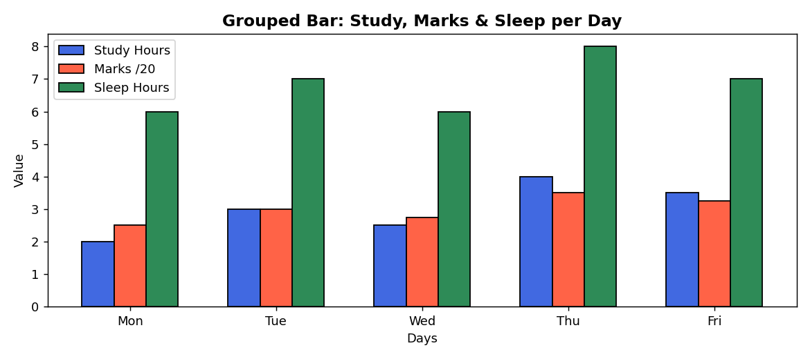

*Side-by-side bars comparing Study Hours, Marks (scaled), and Sleep Hours per day.*

---

#### Chart 5 — Horizontal Bar Chart: Marks per Day

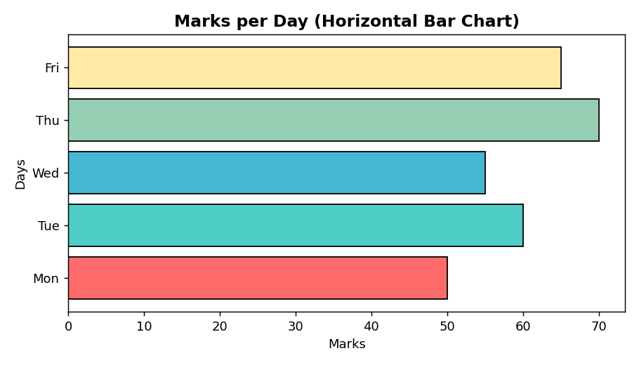

*Horizontal bar chart showing marks — useful when category labels are long.*

---

#### Chart 6 — Histogram: Marks Distribution

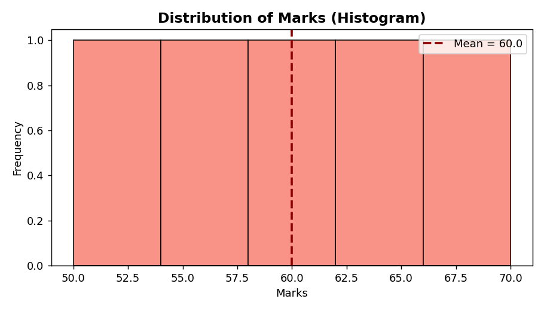

*Frequency distribution of Marks with a mean reference line (red dashed).*

---

#### Chart 7 — Scatter Plot: Study Hours vs Marks (color = Attendance)

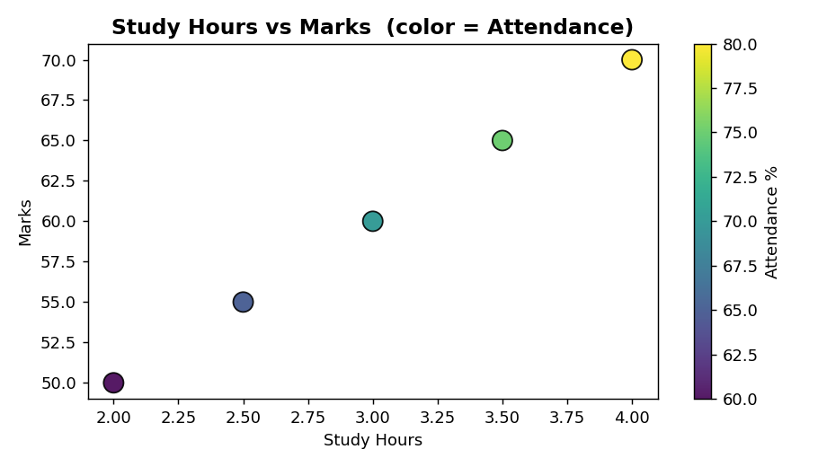

*Scatter plot revealing the positive correlation between study hours and marks. Color encodes Attendance using the `viridis` colormap.*

---

#### Chart 8 — Pie Chart: Marks Share by Day

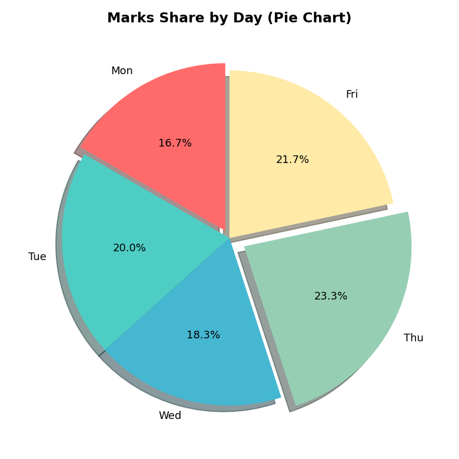

*Pie chart showing each day's proportional contribution to total weekly marks, with Thursday's slice exploded.*

---

#### Chart 9 — Box Plot: Distribution Comparison

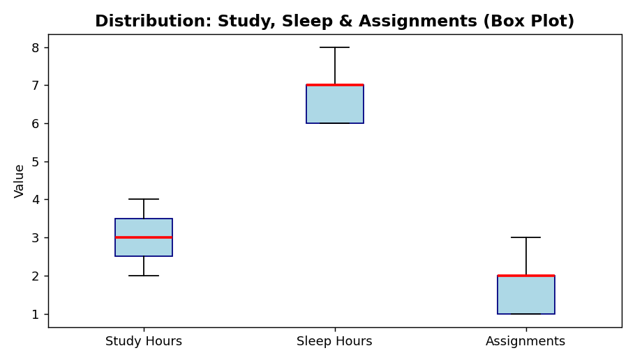

*Box-and-whisker plot comparing the spread of Study Hours, Sleep Hours, and Assignments Completed.*

---

### 📊 Dataset 2 — Seaborn Charts

#### Chart 10 — Seaborn Line Plot: Monthly Marks Trend

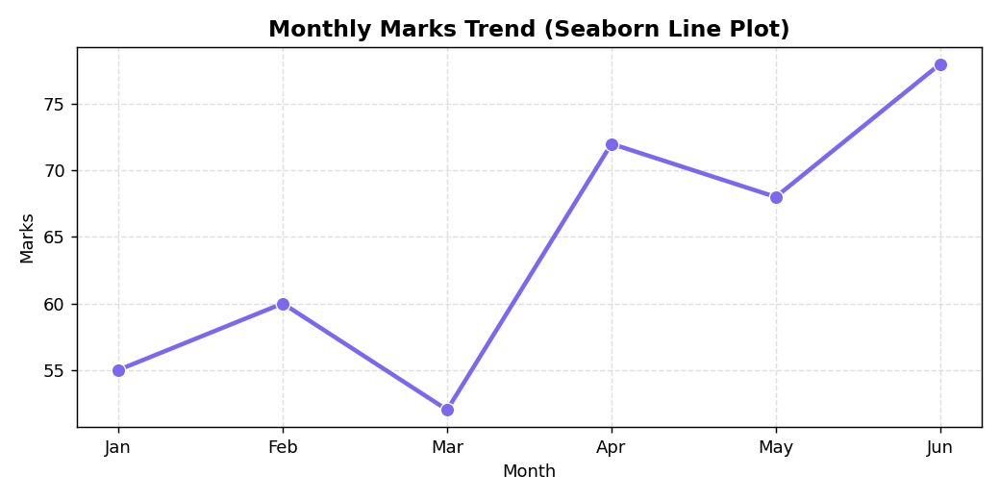

*Seaborn line plot showing monthly marks trend with confidence interval shading.*

---

#### Chart 11 — Seaborn Histogram with KDE Overlay

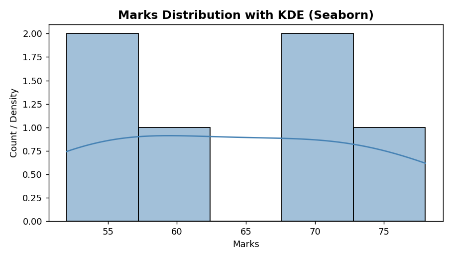

*Histogram overlaid with a smooth KDE curve providing a continuous estimate of the distribution.*

---

#### Chart 12 — Seaborn Scatter Plot with Hue Grouping

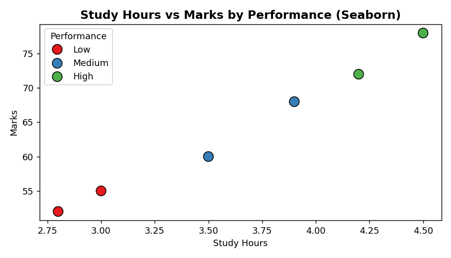

*Scatter plot color-coded by performance category (Low / Medium / High) using Seaborn's `hue` parameter.*

---

### 🎛️ Dataset 3 — Retail Multi-Chart Dashboard

#### Chart 13 — 2×3 Multi-Chart Dashboard

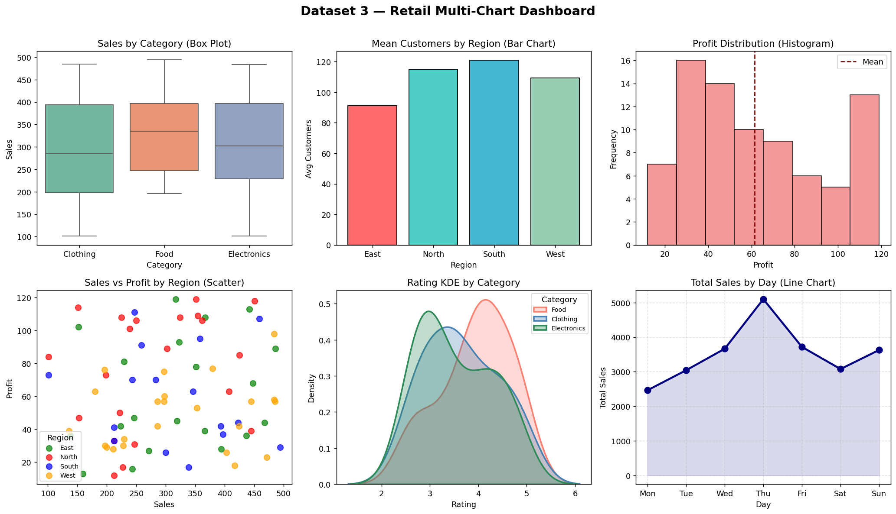

*A comprehensive 2×3 subplot dashboard combining Box Plot, Bar Chart, Histogram, Scatter Plot, KDE, and Line Chart — all from the retail dataset in a single figure.*

---

### 🔬 Extra / Self-Learning Charts

#### Chart 14 — Pair Plot: All Variable Combinations

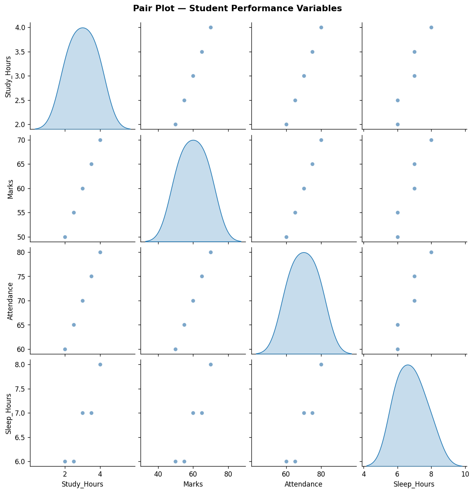

*Matrix of scatter plots and KDE distributions for all numerical variable pairs in the Student Performance dataset.*

---

#### Chart 15 — Correlation Heatmap

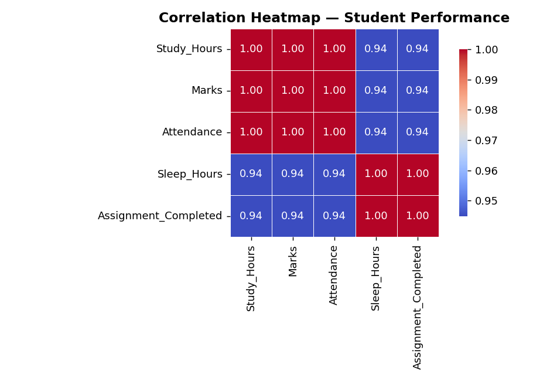

*Color-coded correlation matrix showing the strength and direction of relationships between all numerical columns. Red = positive correlation, Blue = negative.*

---

#### Chart 16 — Violin Plot: Sales & Profit by Category

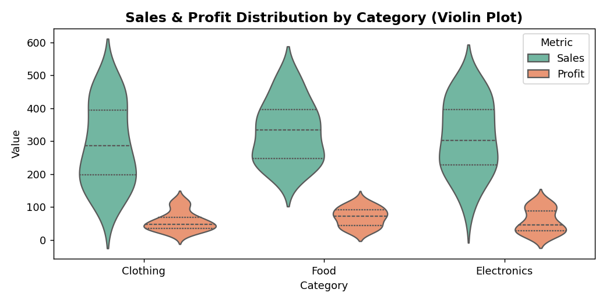

*Violin plots combining box plot statistics with KDE distributions, comparing Sales and Profit across Food, Clothing, and Electronics categories.*

---

## 🧰 Tools Used

| Tool | Version | Purpose |
|------|---------|---------|
| **Python** | 3.x | Programming language |
| **Jupyter Notebook / Google Colab** | Latest | Interactive coding environment |
| **Matplotlib** | 3.x | Core chart plotting library |
| **Seaborn** | 0.12+ | Statistical visualization |
| **Pandas** | 1.x+ | Data loading and manipulation |
| **NumPy** | 1.x+ | Numerical array operations |

---

## 🌍 Applications of Data Visualization

1. **Business Intelligence (BI)** — Sales dashboards, KPI tracking, revenue analysis across product lines and regions using bar charts, line charts, and heatmaps

2. **Healthcare Analytics** — Patient outcome tracking, disease incidence histograms, survival curve line plots, hospital resource utilization box plots

3. **Education** — Student performance monitoring, attendance tracking, assignment completion trends — exactly as explored in this experiment's Dataset 1

4. **Financial Markets** — Candlestick charts, portfolio return distributions (histograms), risk-vs-return scatter plots, correlation heatmaps between assets

5. **Scientific Research** — Experimental result scatter plots with error bars, distribution comparison box plots, pair plots for multivariate relationships

6. **E-Commerce / Retail** — Customer segmentation scatter plots, sales trend line charts, product category comparison bar charts — as explored in Dataset 3

7. **Sports Analytics** — Player performance scatter plots, team comparison grouped bar charts, game stat distributions using histograms and box plots

8. **Social Science** — Survey response pie charts, demographic distribution histograms, socioeconomic scatter plots

---

## ✅ Conclusion

In this experiment, we successfully implemented and analyzed the following:

- **Six fundamental chart types** — Line, Bar, Histogram, Pie, Scatter, and Box Plot — using Matplotlib and Seaborn on real-structured datasets
- **Visual Encoding principles** — how position, color, size, and shape convey data meaning and improve chart readability
- **Three datasets** of increasing complexity, from a 5-row student performance table to a multi-variable retail simulation dataset
- **Seaborn's advanced features** — including `hue` grouping, KDE overlays, confidence intervals, pair plots, heatmaps, violin plots, and subplot dashboards
- **Multi-panel dashboards** using `plt.subplots()` to present multiple views of a dataset simultaneously

**Key Takeaways:**
- The **right chart type** depends entirely on the nature of the data (categorical vs. continuous, single variable vs. relational)
- **Visual encoding** (color, size, shape) adds dimensionality to charts without adding clutter
- **Seaborn** greatly simplifies grouped and statistical visualizations compared to raw Matplotlib
- A well-designed **subplot dashboard** communicates a complete data story in a single figure

This experiment forms the foundation for more advanced topics in Exploratory Data Analysis (EDA), machine learning feature inspection, and data storytelling.

---

## 📝 Extra Notes

### 🔹 Common Marker Types in Matplotlib

| Marker Code | Shape |
|-------------|-------|
| `'o'` | Circle ● |
| `'s'` | Square ■ |
| `'^'` | Triangle Up ▲ |
| `'v'` | Triangle Down ▼ |
| `'x'` | Cross ✖ |
| `'*'` | Star ⭐ |
| `'+'` | Plus ➕ |
| `'D'` | Diamond ◆ |

---

### 🔹 Common Color Shortcuts

| Short Code | Color |
|------------|-------|
| `'b'` | Blue |
| `'r'` | Red |
| `'g'` | Green |
| `'k'` | Black |
| `'w'` | White |
| `'c'` | Cyan |
| `'m'` | Magenta |
| `'y'` | Yellow |

---

### 🔹 Choosing the Right Chart — Quick Reference

```
What do you want to show?
│
├── Trend over time            →  Line Chart
├── Compare categories         →  Bar Chart
├── Distribution of values     →  Histogram / Box Plot
├── Part-to-whole proportion   →  Pie Chart
├── Relationship / Correlation →  Scatter Plot
├── Compare distributions      →  Box Plot / Violin Plot
└── Multiple variables         →  Pair Plot / Heatmap
```

---

### 🔹 Summary of Charts Covered

| Section | Charts Covered |
|---------|---------------|
| Dataset 1 — Matplotlib | Line, Advanced Line, Vertical Bar, Grouped Bar, Horizontal Bar, Histogram, Scatter with Color Mapping, Pie, Box Plot |
| Dataset 2 — Seaborn | Line Plot with CI, Histogram with KDE, Scatter with Hue |
| Dataset 3 — Dashboard | Box Plot, Bar Chart, Histogram, Scatter, KDE, Line Chart |
| Extra / Self-Learning | Pair Plot, Correlation Heatmap, Violin Plot |

---

<div align="center">

**Made by Tanmay Agarwal | EnTC A3 | PRN: 25070123158**

*Experiment 16 — EDA | Basic Charts and Visual Encoding*

</div>
