# 📊 Experiment 18 – Real-World and Interactive Visualizations

---

## 📋 Title Page

| **Field**           | **Details**                                                         |
| ------------------- | ------------------------------------------------------------------- |
| **Name**            | Tanmay Agarwal                                                      |
| **PRN**             | 25070123158                                                         |
| **Branch / Batch**  | EnTC A3                                                             |
| **Experiment No.**  | 18                                                                  |
| **Subject**         | Exploratory Data Analysis (EDA)                                     |
| **Date**            | 10 / 04 / 2026                                                      |
| **Title**           | Real-World and Interactive Visualizations                           |

---

## 🎯 Aim of the Experiment

To explore and implement various **real-world and interactive visualization techniques** using Python libraries such as Plotly, Matplotlib, and specialized plotting libraries. The experiment aims to:

1. Understand the importance of interactive visualizations in data analysis
2. Learn to create hierarchical visualizations (Treemap, Sunburst, Dendrogram)
3. Implement flow-based visualizations (Sankey Diagram, Funnel Chart)
4. Master multi-dimensional visualizations (3D Scatter, Parallel Coordinates)
5. Develop skills in creating specialized charts (Radar, Gauge, Network Graph)

---

## 📖 Introduction

Interactive and specialized visualizations go beyond basic charts to represent complex data relationships, hierarchical structures, and multi-dimensional data. These advanced visualization techniques are essential for:

- **Hierarchical Data**: Understanding parent-child relationships in data
- **Flow Analysis**: Visualizing how entities move through stages
- **Multi-dimensional Analysis**: Comparing entities across multiple variables
- **Network Relationships**: Understanding connections between entities
- **Geographic Data**: Visualizing data on maps for regional analysis
- **Real-time Dashboards**: Creating KPI monitors and performance indicators

Modern data visualization requires tools that can handle complex data structures while providing interactivity for exploration. Plotly, with its interactive capabilities, combined with specialized libraries like NetworkX and Matplotlib-Venn, provides a comprehensive toolkit for advanced visualizations.

---

## 🔬 About Interactive Visualization

### What is Interactive Visualization?

Interactive visualization allows users to:
- **Zoom and Pan**: Explore data at different scales
- **Hover for Details**: See additional information on demand
- **Filter and Highlight**: Focus on specific data subsets
- **Animate Over Time**: Watch data evolve
- **Toggle Views**: Switch between different representations

### Importance in Data Analysis

| Benefit | Description |
|---------|-------------|
| **Exploration** | Discover patterns through interaction |
| **Communication** | Tell compelling data stories |
| **Decision Making** | Understand complex relationships |
| **Engagement** | Increase stakeholder involvement |
| **Accessibility** | Make complex data understandable |

### Types of Advanced Visualizations

| Category | Examples | Use Case |
|----------|----------|----------|
| **Hierarchical** | Treemap, Sunburst, Dendrogram | Organization structure, file systems |
| **Flow-based** | Sankey, Funnel | Process flows, conversion analysis |
| **Multi-dimensional** | Radar, Parallel Coordinates | Performance comparison |
| **Network** | Graph plots, Network diagrams | Social networks, dependencies |
| **Geographic** | Choropleth, Map scatter | Regional analysis |
| **3D** | Surface, Scatter | Mathematical functions, spatial data |

---

## 📚 About Libraries Used

### 🎨 Plotly Express

**Plotly Express** is a high-level interface for creating interactive visualizations with minimal code.

**Key Features:**
- One-line interactive charts
- Built-in animations
- Automatic legends and tooltips
- Faceting and animations
- Seamless Pandas integration

```python
import plotly.express as px
fig = px.scatter(df, x='col1', y='col2', color='category')
fig.show()
```

---

### 📊 Plotly Graph Objects

**Plotly Graph Objects (go)** provides low-level control over every aspect of visualizations.

**Key Features:**
- Fine-grained customization
- Complex multi-trace figures
- Custom animations
- Specialized chart types
- Dashboard creation

```python
import plotly.graph_objects as go
fig = go.Figure(data=[go.Scatter(x=x, y=y)])
fig.update_layout(title='My Plot')
fig.show()
```

---

### 🌐 NetworkX

**NetworkX** is a Python library for creating and analyzing complex networks and graphs.

**Key Features:**
- Graph creation and manipulation
- Network analysis algorithms
- Centrality measures
- Community detection
- Visualization layouts

```python
import networkx as nx
G = nx.Graph()
G.add_edges_from([('A', 'B'), ('B', 'C')])
```

---

### 📈 SciPy Cluster

**SciPy** provides hierarchical clustering and dendrogram visualization.

**Key Features:**
- Linkage methods (ward, single, complete)
- Dendrogram plotting
- Distance calculations
- Cluster analysis

```python
from scipy.cluster.hierarchy import dendrogram, linkage
linked = linkage(data, method='ward')
dendrogram(linked)
```

---

### 🔵 Matplotlib-Venn

**Matplotlib-Venn** creates Venn diagrams for set visualization.

**Key Features:**
- 2-set and 3-set Venn diagrams
- Customizable colors and labels
- Automatic area proportional sizing

```python
from matplotlib_venn import venn2
venn2([set1, set2], set_labels=('A', 'B'))
```

---

## 📈 Visualization Techniques

### 1. Treemap

**Definition:**
A treemap displays hierarchical data using nested rectangles. The size of each rectangle represents the value, and colors can indicate categories.

**Syntax:**
```python
import plotly.express as px
fig = px.treemap(df, path=['Category'], values='Value')
fig.show()
```

**When to Use:**
- Hierarchical data visualization
- Part-to-whole relationships
- Budget allocation
- File system visualization

**Output:**
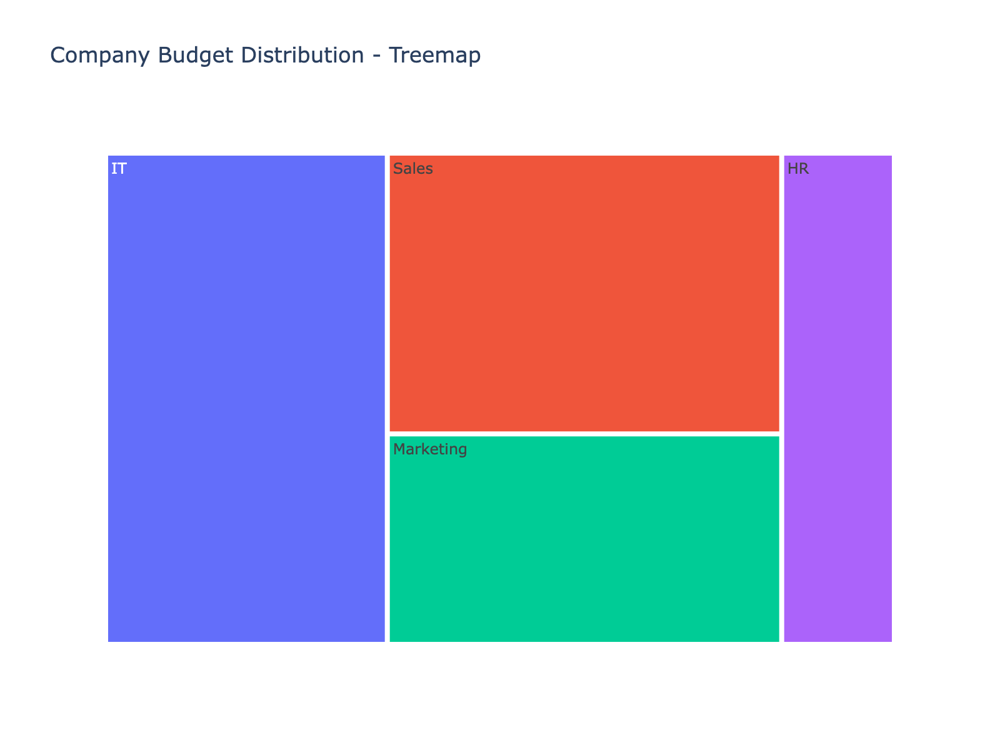

---

### 2. Dendrogram

**Definition:**
A dendrogram shows hierarchical clustering relationships. It displays how data points merge into clusters based on similarity.

**Syntax:**
```python
from scipy.cluster.hierarchy import dendrogram, linkage
linked = linkage(data, method='ward')
dendrogram(linked)
plt.show()
```

**When to Use:**
- Clustering analysis
- Taxonomy visualization
- Hierarchical relationships
- Distance representation

**Output:**
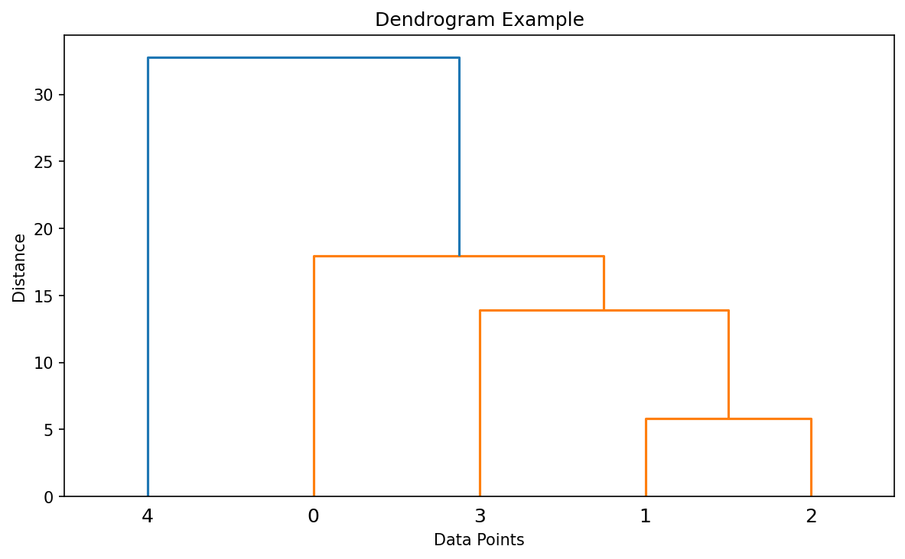

---

### 3. Venn Diagram

**Definition:**
A Venn diagram shows relationships between sets, highlighting intersections and unique elements.

**Syntax:**
```python
from matplotlib_venn import venn2
A = {1, 2, 3, 4}
B = {3, 4, 5, 6}
venn2([A, B], set_labels=('Set A', 'Set B'))
plt.show()
```

**When to Use:**
- Set operations visualization
- Logical relationships
- Comparison of groups
- Intersection analysis

**Output:**
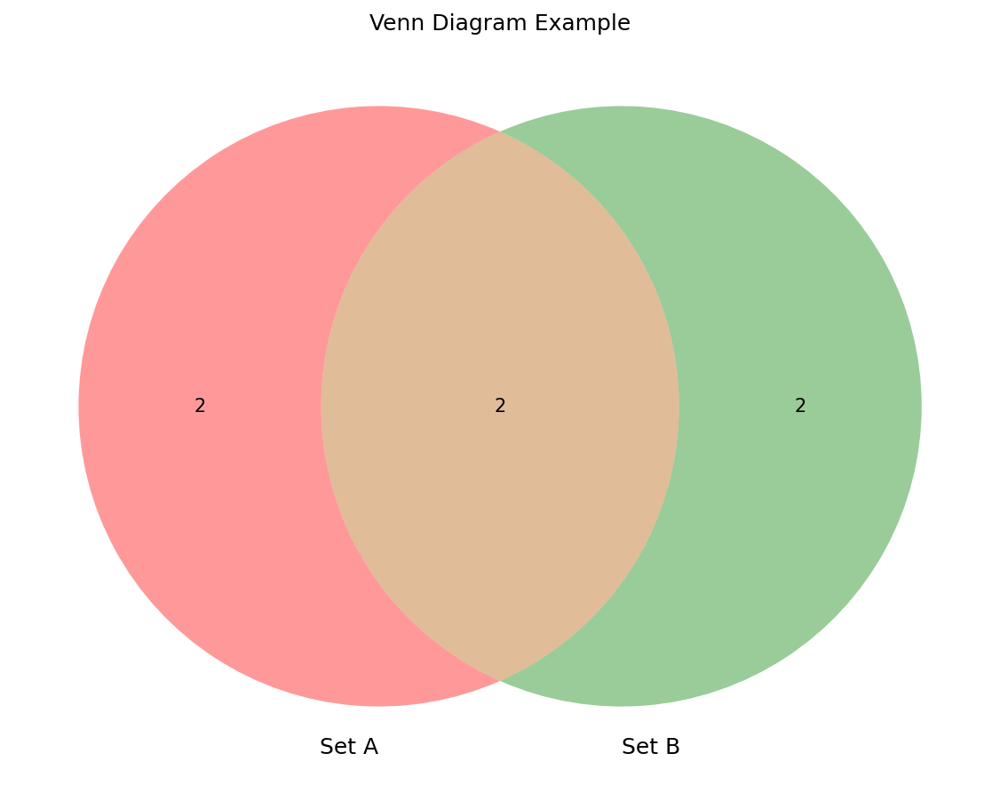

---

### 4. Sankey Diagram

**Definition:**
A Sankey diagram visualizes flow between nodes, with link width proportional to flow quantity.

**Syntax:**
```python
import plotly.graph_objects as go
fig = go.Figure(data=[go.Sankey(
    node=dict(label=["A", "B", "C"]),
    link=dict(source=[0, 1], target=[1, 2], value=[100, 80])
)])
fig.show()
```

**When to Use:**
- Process flow visualization
- Energy/material flow
- Customer journey mapping
- Resource allocation

**Output:**
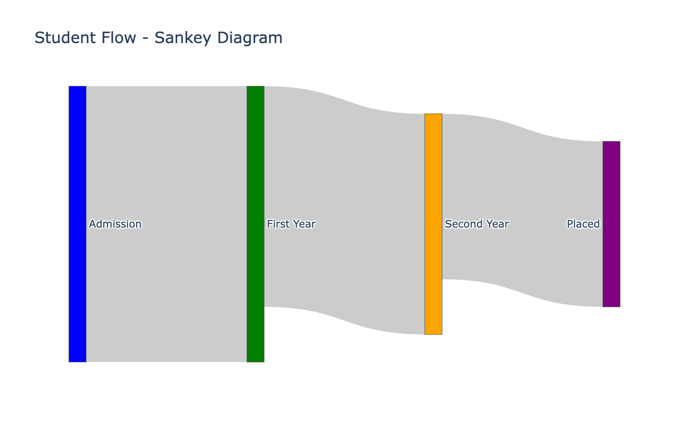

---

### 5. 3D Scatter Plot

**Definition:**
A 3D scatter plot displays data points in three-dimensional space using x, y, and z coordinates.

**Syntax:**
```python
import plotly.express as px
fig = px.scatter_3d(df, x='col1', y='col2', z='col3')
fig.show()
```

**When to Use:**
- Three-variable relationships
- Spatial data visualization
- Performance analysis
- Scientific data

**Output:**
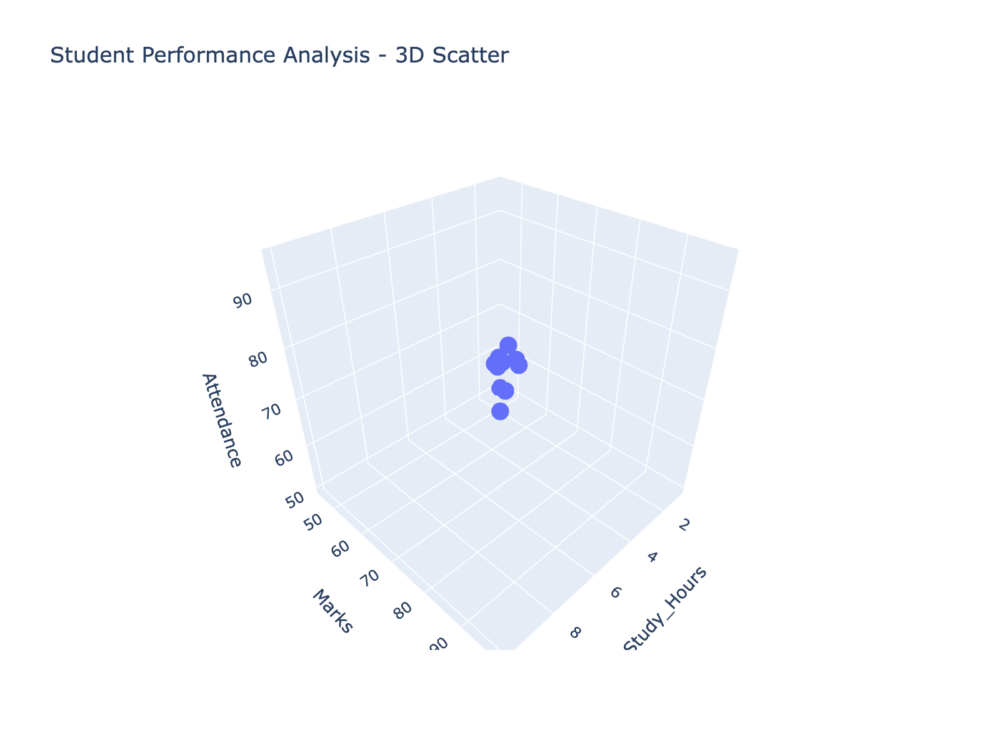

---

### 6. Radar Chart (Spider/Polar Chart)

**Definition:**
A radar chart displays multivariate data as a two-dimensional chart with axes radiating from the center.

**Syntax:**
```python
import plotly.graph_objects as go
fig = go.Figure()
fig.add_trace(go.Scatterpolar(
    r=[4, 3, 5, 4, 3],
    theta=['Python', 'ML', 'DBMS', 'DSA', 'Comm'],
    fill='toself'
))
fig.show()
```

**When to Use:**
- Skill comparison
- Performance metrics
- Multi-criteria decisions
- Competency analysis

**Output:**
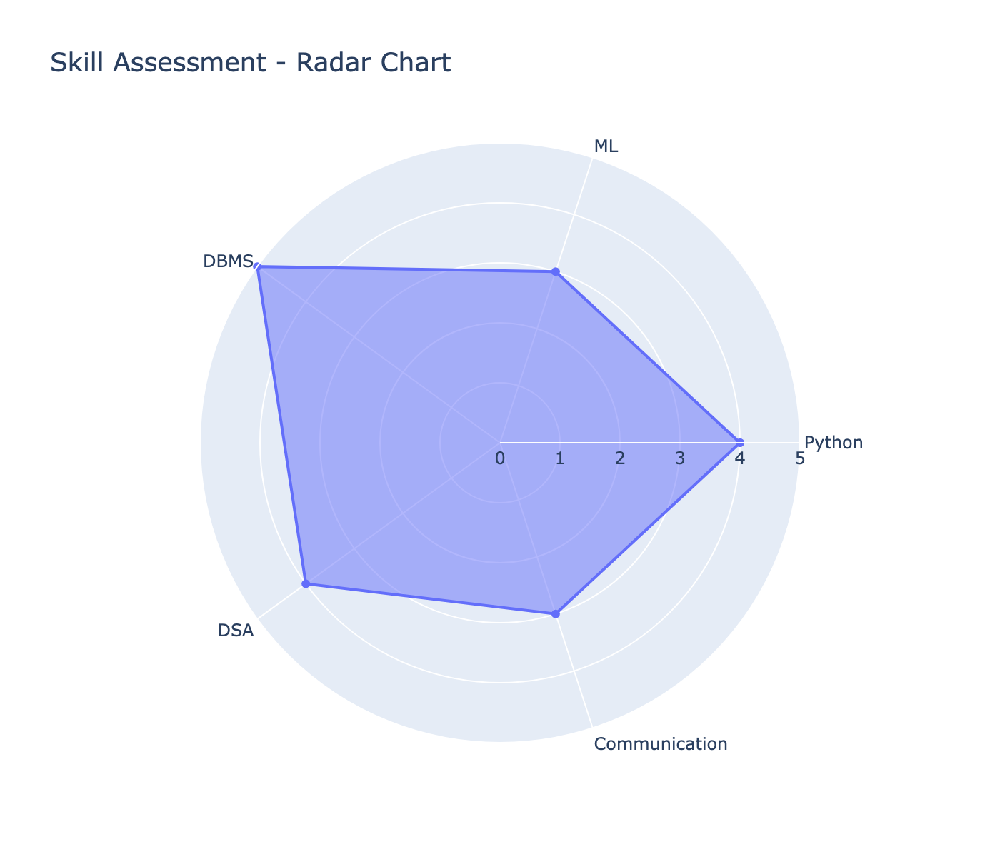

---

## 🚀 Extra / Self Learning (Advanced Visualizations)

### 7. Sunburst Chart

**Definition:**
A sunburst chart is a circular hierarchical visualization where inner circles represent higher levels and outer circles represent lower levels.

**Syntax:**
```python
import plotly.express as px
fig = px.sunburst(df, names='Entity', parents='Parent', values='Value')
fig.show()
```

**When to Use:**
- Hierarchical data in circular format
- File system visualization
- Organization structure
- Budget breakdown by category

**Output:**
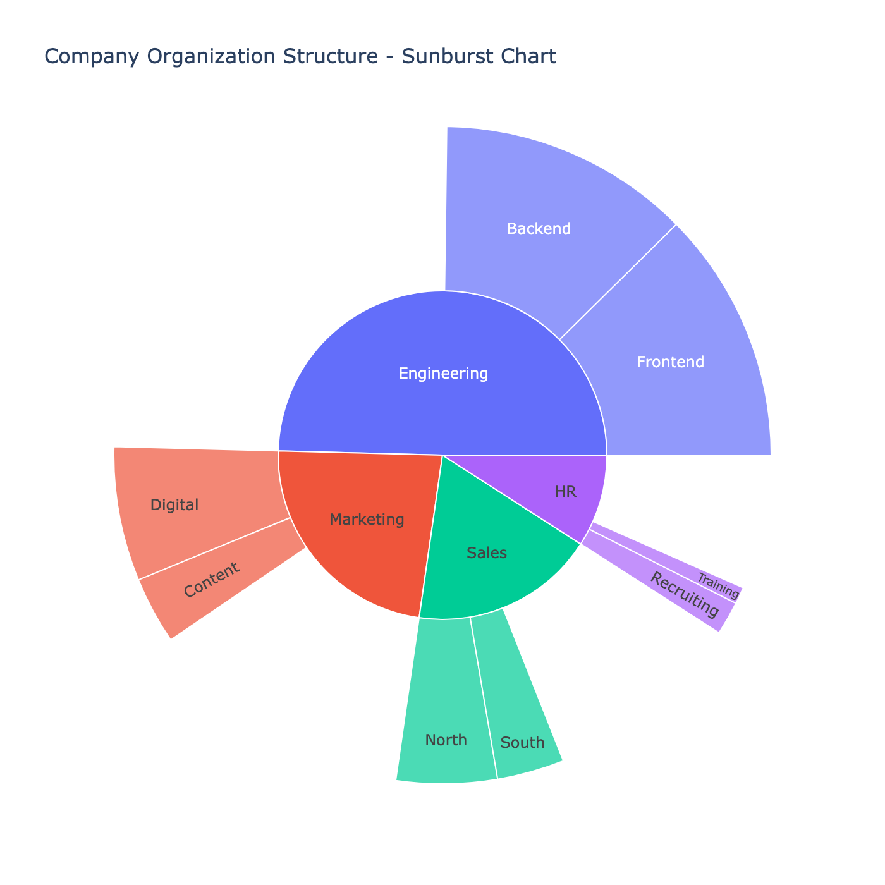

---

### 8. Parallel Coordinates Plot

**Definition:**
A parallel coordinates plot displays high-dimensional data where each vertical axis represents a variable, and lines connect observations across axes.

**Syntax:**
```python
import plotly.express as px
fig = px.parallel_coordinates(df, dimensions=['var1', 'var2', 'var3'], color='target')
fig.show()
```

**When to Use:**
- High-dimensional data analysis
- Feature comparison
- Pattern identification
- Outlier detection

**Output:**
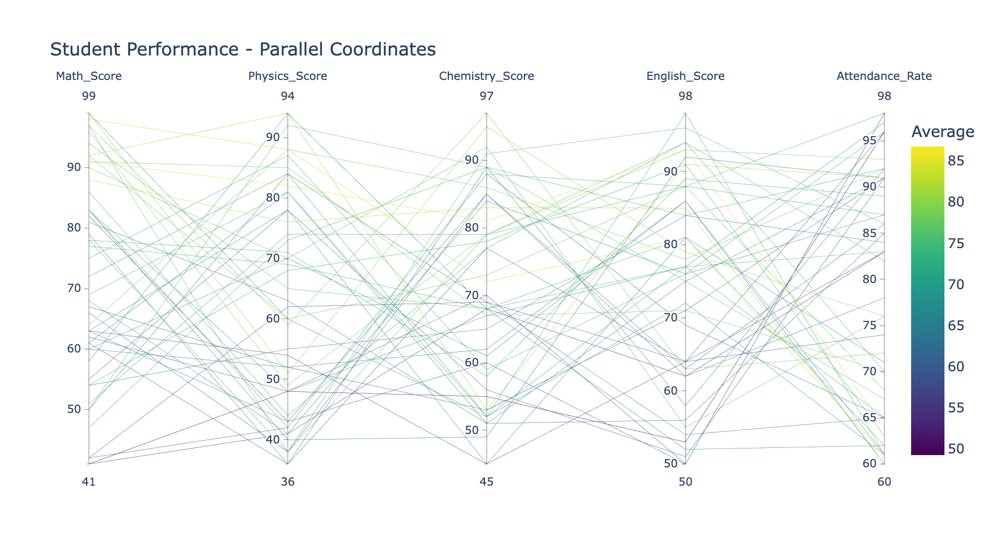

---

### 9. Animated Scatter Plot

**Definition:**
An animated scatter plot shows how data evolves over time by animating transitions between time points.

**Syntax:**
```python
import plotly.express as px
fig = px.scatter(df, x='x', y='y', animation_frame='year', animation_group='country')
fig.show()
```

**When to Use:**
- Time series evolution
- Trend visualization
- Storytelling with data
- Dynamic dashboards

**Output:**
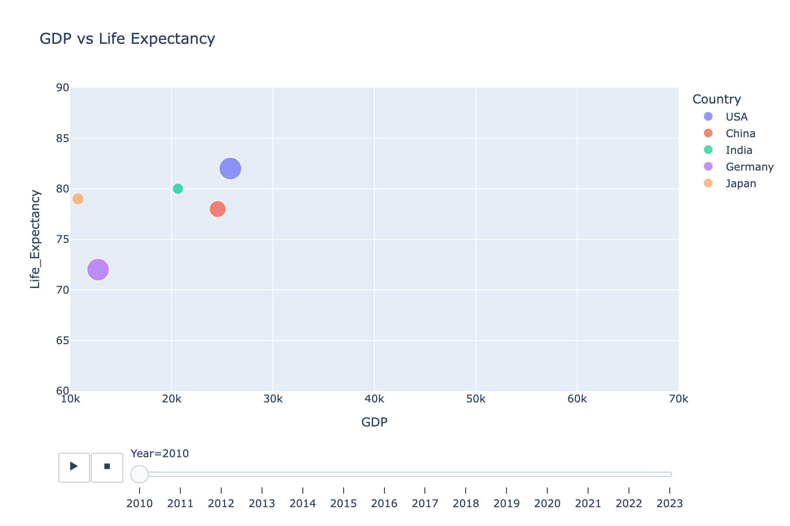

---

### 10. Gauge Chart (Speedometer)

**Definition:**
A gauge chart displays a single metric within a range, commonly used for KPIs and performance indicators.

**Syntax:**
```python
import plotly.graph_objects as go
fig = go.Figure(go.Indicator(
    mode="gauge+number", value=75,
    gauge={'axis': {'range': [0, 100]}}
))
fig.show()
```

**When to Use:**
- KPI dashboards
- Performance monitoring
- Goal tracking
- Status indicators

**Output:**
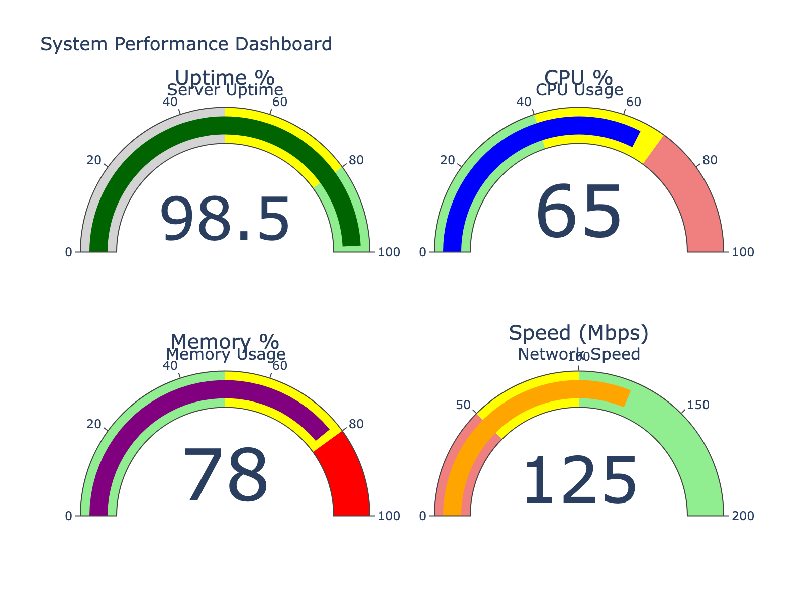

---

### 11. Funnel Chart

**Definition:**
A funnel chart visualizes stages in a process, showing how values decrease through successive stages.

**Syntax:**
```python
import plotly.graph_objects as go
fig = go.Figure(go.Funnel(y=stages, x=values))
fig.show()
```

**When to Use:**
- Sales pipeline analysis
- Conversion tracking
- Process optimization
- Customer journey

**Output:**
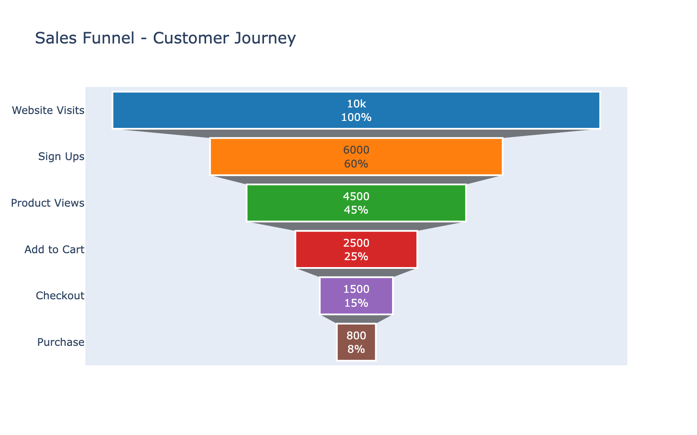

---

### 12. Waterfall Chart

**Definition:**
A waterfall chart shows how positive and negative values contribute to a running total.

**Syntax:**
```python
import plotly.graph_objects as go
fig = go.Figure(go.Waterfall(x=categories, y=values, measure=['absolute', 'relative']))
fig.show()
```

**When to Use:**
- Financial analysis
- Budget changes
- Variance analysis
- Cumulative effects

**Output:**
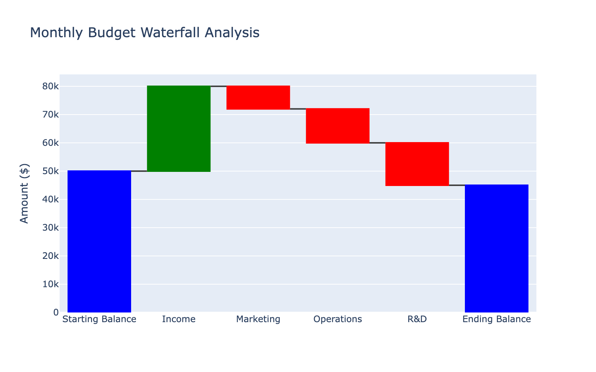

---

### 13. Network Graph

**Definition:**
A network graph visualizes relationships between entities using nodes and edges.

**Syntax:**
```python
import networkx as nx
G = nx.Graph()
G.add_edges_from(connections)
nx.draw_networkx(G)
```

**When to Use:**
- Social network analysis
- Dependency visualization
- Relationship mapping
- Infrastructure diagrams

**Output:**
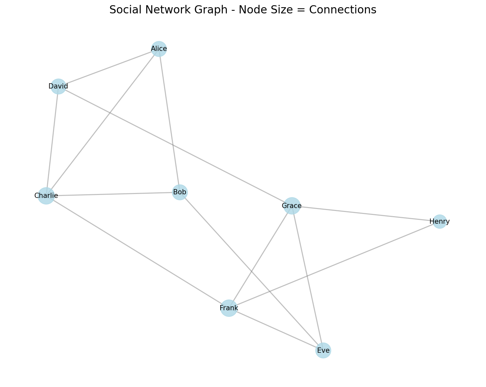

---

### 14. Choropleth Map

**Definition:**
A choropleth map displays data on a geographic map using color intensity to represent values.

**Syntax:**
```python
import plotly.express as px
fig = px.choropleth(df, locations='Country', locationmode='country names', color='Value')
fig.show()
```

**When to Use:**
- Geographic data analysis
- Population distribution
- Regional comparisons
- Election results

**Output:**
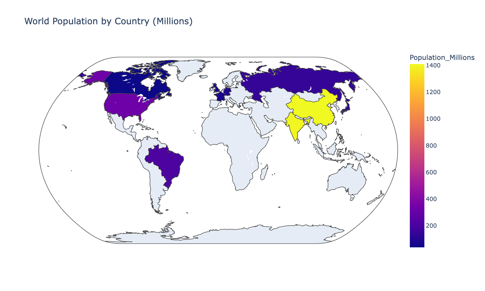

---

### 15. Density Contour Plot

**Definition:**
A density contour plot shows the density of data points in 2D space, similar to a topographical map.

**Syntax:**
```python
import plotly.express as px
fig = px.density_contour(df, x='x', y='y')
fig.show()
```

**When to Use:**
- 2D density estimation
- Cluster identification
- Distribution analysis
- Spatial patterns

**Output:**
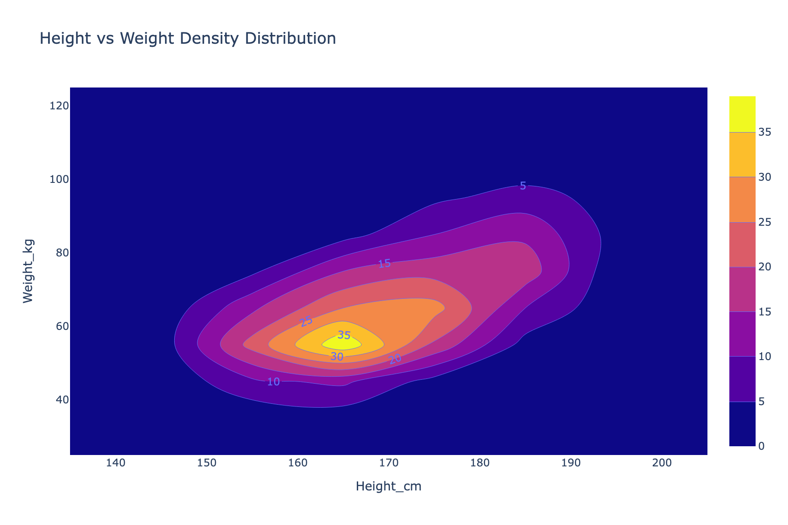

---

### 16. Polar Scatter Plot

**Definition:**
A polar scatter plot displays data points on a circular coordinate system using radius and angle.

**Syntax:**
```python
import plotly.graph_objects as go
fig = go.Figure(go.Scatterpolar(r=radius, theta=angles, mode='markers'))
fig.show()
```

**When to Use:**
- Wind direction analysis
- Antenna patterns
- Compass data
- Circular periodic data

**Output:**
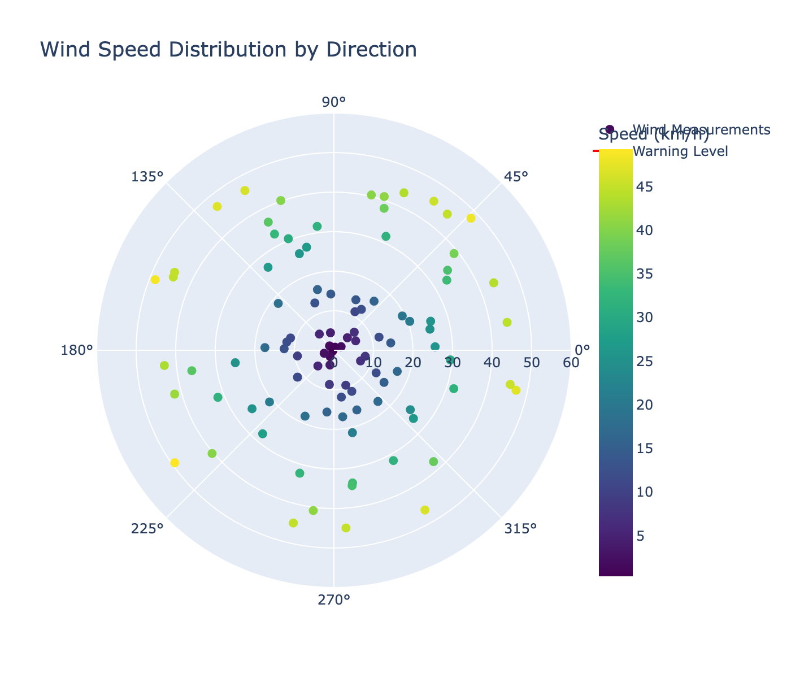

---

### 17. 3D Surface Plot

**Definition:**
A 3D surface plot visualizes a mathematical function z = f(x, y) as a continuous surface.

**Syntax:**
```python
import plotly.graph_objects as go
import numpy as np
fig = go.Figure(go.Surface(z=Z, x=X, y=Y))
fig.show()
```

**When to Use:**
- Mathematical functions
- Scientific visualization
- Terrain modeling
- Optimization surfaces

**Output:**
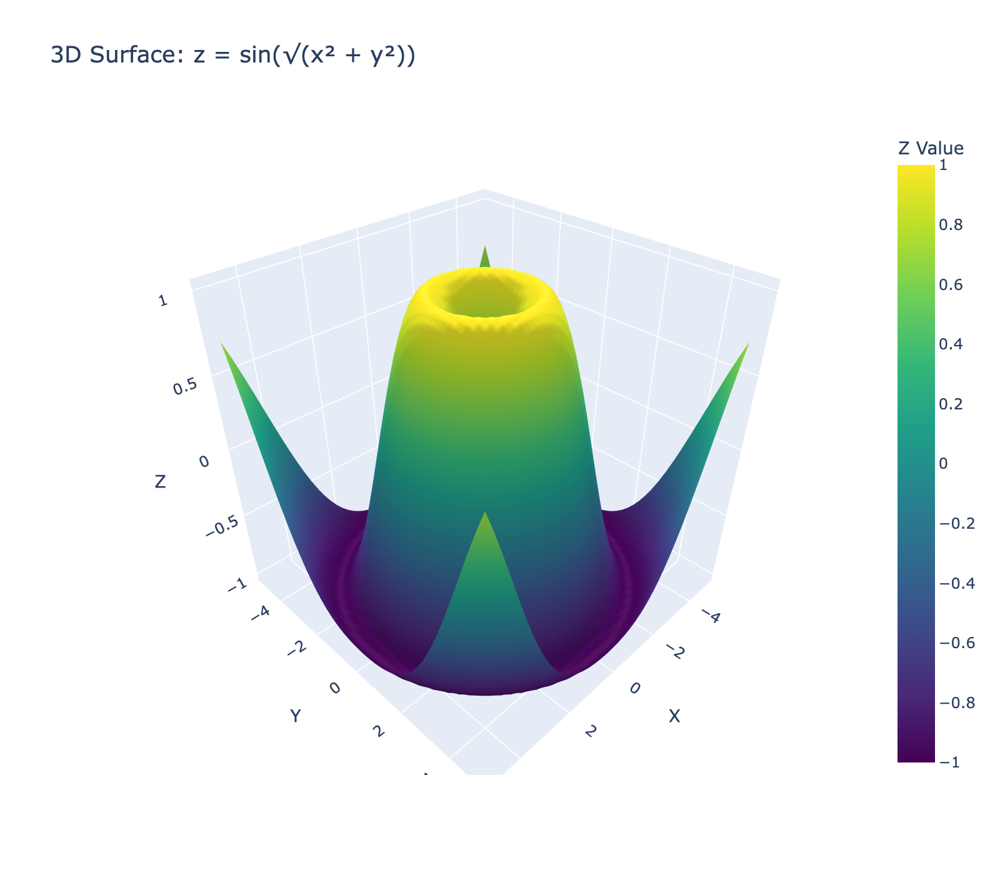

---

### 18. Multiple Radar Charts

**Definition:**
Multiple overlapping radar charts allow comparison of multiple entities across several dimensions.

**Syntax:**
```python
for entity in entities:
    fig.add_trace(go.Scatterpolar(r=scores, theta=categories, fill='toself'))
```

**When to Use:**
- Multi-entity comparison
- Skill assessment
- Performance benchmarking
- Competitive analysis

**Output:**
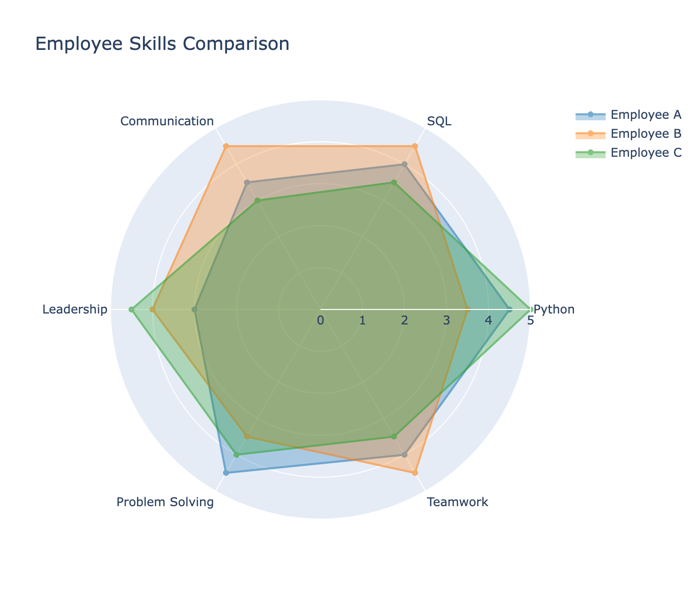

---

### 19. Bullet Chart

**Definition:**
A bullet chart shows actual performance against target with qualitative ranges for context.

**Syntax:**
```python
# Using matplotlib for static version
plt.barh(0, max_val, height=0.5, color='lightgray')
plt.barh(0, actual, height=0.3, color='darkblue')
plt.axvline(x=target, color='red', linestyle='--')
```

**When to Use:**
- KPI dashboards
- Performance tracking
- Goal monitoring
- Executive summaries

**Output:**
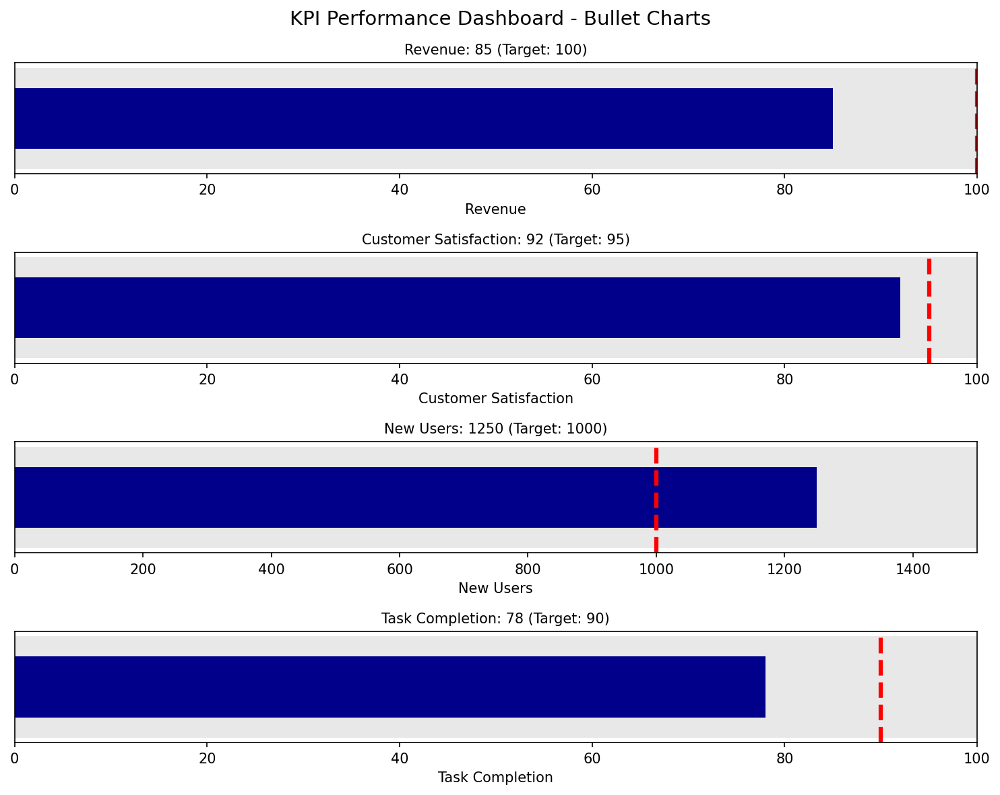

---

## 📋 Functions and Commands Table

| Function / Command | Library | Description |
|-------------------|---------|-------------|
| `px.treemap()` | Plotly Express | Create treemap visualization |
| `px.sunburst()` | Plotly Express | Create sunburst chart |
| `px.scatter_3d()` | Plotly Express | Create 3D scatter plot |
| `px.choropleth()` | Plotly Express | Create geographic map |
| `px.parallel_coordinates()` | Plotly Express | Create parallel coordinates plot |
| `px.density_contour()` | Plotly Express | Create density contour plot |
| `go.Sankey()` | Plotly Graph Objects | Create Sankey diagram |
| `go.Scatterpolar()` | Plotly Graph Objects | Create radar/polar chart |
| `go.Indicator()` | Plotly Graph Objects | Create gauge/bullet charts |
| `go.Funnel()` | Plotly Graph Objects | Create funnel chart |
| `go.Waterfall()` | Plotly Graph Objects | Create waterfall chart |
| `go.Surface()` | Plotly Graph Objects | Create 3D surface plot |
| `dendrogram()` | SciPy | Create hierarchical dendrogram |
| `linkage()` | SciPy | Perform hierarchical clustering |
| `venn2()` | Matplotlib-Venn | Create 2-set Venn diagram |
| `venn3()` | Matplotlib-Venn | Create 3-set Venn diagram |
| `nx.Graph()` | NetworkX | Create graph object |
| `nx.draw_networkx()` | NetworkX | Draw network visualization |
| `nx.spring_layout()` | NetworkX | Calculate node positions |
| `fig.update_layout()` | Plotly | Update figure layout |
| `fig.show()` | Plotly | Display interactive figure |
| `fig.write_image()` | Plotly | Save figure as image |

---

## 🔢 Algorithm / Logic

### Step-by-Step Procedure

```
STEP 1: Import Libraries
        - Import plotly.express, plotly.graph_objects
        - Import matplotlib.pyplot for static plots
        - Import specialized libraries (networkx, scipy, matplotlib-venn)

STEP 2: Prepare Data
        - Create pandas DataFrame for structured data
        - Define hierarchical relationships for treemap/sunburst
        - Prepare node and link data for Sankey diagrams

STEP 3: Create Basic Visualizations
        - Treemap for hierarchical data
        - Dendrogram for clustering
        - Venn diagram for set operations
        - Sankey diagram for flow analysis

STEP 4: Create 3D Visualizations
        - 3D scatter plots for three variables
        - 3D surface plots for mathematical functions
        - Configure camera angles and rotation

STEP 5: Create Multi-dimensional Charts
        - Radar charts for skill comparison
        - Parallel coordinates for high-dimensional data
        - Configure axes and scaling

STEP 6: Create Specialized Charts
        - Gauge charts for KPIs
        - Funnel charts for conversion
        - Waterfall charts for financial analysis
        - Network graphs for relationships

STEP 7: Add Interactivity
        - Configure hover tooltips
        - Add zoom and pan
        - Implement animations
        - Add color scales

STEP 8: Customize Layout
        - Set titles and labels
        - Configure legends
        - Adjust margins and sizing
        - Apply color themes

STEP 9: Display and Save
        - Use fig.show() for interactive display
        - Use fig.write_html() for web export
        - Use fig.write_image() for static export
```

---

## 📊 Charts / Output Section

### Core Experiment Visualizations

| # | Chart | Description |
|---|-------|-------------|
| 1 | Treemap | Company budget distribution |
| 2 | Dendrogram | Hierarchical clustering example |
| 3 | Venn Diagram | Set relationships |
| 4 | Sankey Diagram | Student flow analysis |
| 5 | 3D Scatter Plot | Student performance analysis |
| 6 | Radar Chart | Skill assessment |

### Self-Learning Visualizations

| # | Chart | Description |
|---|-------|-------------|
| 7 | Sunburst Chart | Organization hierarchy |
| 8 | Parallel Coordinates | Multi-dimensional student analysis |
| 9 | Animated Scatter | GDP vs Life Expectancy over time |
| 10 | Gauge Charts | System performance dashboard |
| 11 | Funnel Chart | Sales pipeline analysis |
| 12 | Waterfall Chart | Budget analysis |
| 13 | Network Graph | Social network visualization |
| 14 | Choropleth Map | World population by country |
| 15 | Density Contour | Height vs Weight distribution |
| 16 | Polar Scatter | Wind speed by direction |
| 17 | 3D Surface | Mathematical surface visualization |
| 18 | Multiple Radar | Employee skills comparison |
| 19 | Bullet Charts | KPI performance dashboard |
| 20 | Summary Table | Visualization techniques overview |

---

## 📁 Dataset Descriptions

### Dataset 1: Company Budget Data
- **Purpose**: Treemap demonstration
- **Variables**: Department, Budget
- **Records**: 4 departments

### Dataset 2: Clustering Data
- **Purpose**: Dendrogram demonstration
- **Variables**: X, Y coordinates
- **Records**: 5 data points

### Dataset 3: Set Data
- **Purpose**: Venn diagram demonstration
- **Variables**: Set A, Set B
- **Intersection**: {3, 4}

### Dataset 4: Student Flow Data
- **Purpose**: Sankey diagram demonstration
- **Stages**: Admission → First Year → Second Year → Placed
- **Flow values**: 100, 80, 60

### Dataset 5: Student Performance
- **Purpose**: 3D scatter demonstration
- **Variables**: Study Hours, Marks, Attendance
- **Records**: 5 students

### Dataset 6: Skills Assessment
- **Purpose**: Radar chart demonstration
- **Variables**: Python, ML, DBMS, DSA, Communication
- **Scale**: 1-5

---

## 🛠️ Tools Used

| Tool | Version | Purpose |
|------|---------|---------|
| **Python** | 3.9+ | Programming language |
| **Jupyter Notebook** | Latest | Interactive development |
| **Plotly** | 5.x | Interactive visualizations |
| **Plotly Express** | Built-in | High-level plotting |
| **Matplotlib** | 3.x | Static visualizations |
| **NetworkX** | 3.x | Network analysis |
| **SciPy** | 1.x | Scientific computing |
| **Matplotlib-Venn** | Latest | Venn diagrams |
| **Pandas** | 2.x | Data manipulation |
| **NumPy** | 1.24+ | Numerical computing |

---

## 💼 Applications

### Business Intelligence
- **Dashboards**: KPI monitoring with gauge charts
- **Sales Analysis**: Funnel charts for conversion tracking
- **Budget Visualization**: Treemaps for allocation

### Data Science
- **Exploratory Analysis**: Parallel coordinates for feature inspection
- **Clustering**: Dendrograms for hierarchical clustering
- **Network Analysis**: Graph visualizations

### Geographic Analysis
- **Regional Data**: Choropleth maps for population
- **Location Intelligence**: Spatial patterns
- **Market Analysis**: Regional comparisons

### Scientific Visualization
- **Mathematical Functions**: 3D surface plots
- **Experimental Data**: Density contour plots
- **Directional Data**: Polar scatter plots

### Project Management
- **Timelines**: Gantt charts
- **Resource Flow**: Sankey diagrams
- **Process Analysis**: Funnel charts

---

## 📝 Conclusion

This experiment successfully demonstrated various **real-world and interactive visualization techniques** using Python libraries. Key learnings include:

### Core Techniques Mastered:
1. **Hierarchical Visualization**: Treemap and Dendrogram for nested data structures
2. **Flow Visualization**: Sankey diagrams for process analysis
3. **Multi-dimensional Analysis**: Radar charts and 3D scatter plots
4. **Set Visualization**: Venn diagrams for logical operations

### Advanced Techniques Explored:
5. **Interactive Dashboards**: Gauge charts for KPI monitoring
6. **Process Analysis**: Funnel and waterfall charts
7. **Network Visualization**: Graph plots for relationships
8. **Geographic Analysis**: Choropleth maps
9. **Mathematical Visualization**: 3D surface plots

### Key Takeaways:
- Interactive visualizations enhance data exploration
- Different data types require specific visualization techniques
- Plotly provides both simplicity (Express) and power (Graph Objects)
- Combining visualizations creates powerful dashboards
- Understanding your data helps choose the right visualization

---

## 📌 Extra Notes

### Best Practices for Interactive Visualizations

1. **Choose Wisely**: Match visualization type to data characteristics
2. **Keep It Simple**: Don't overwhelm with too many elements
3. **Use Color Thoughtfully**: Consider colorblind accessibility
4. **Provide Context**: Include legends, labels, and tooltips
5. **Optimize Performance**: Large datasets may need aggregation

### Common Pitfalls to Avoid

- ❌ Overcrowded visualizations
- ❌ Missing context or labels
- ❌ Poor color choices
- ❌ Inconsistent scales
- ❌ Excessive animation

### Resources for Further Learning

- [Plotly Documentation](https://plotly.com/python/)
- [NetworkX Tutorial](https://networkx.org/documentation/stable/tutorial.html)
- [Matplotlib Gallery](https://matplotlib.org/gallery.html)
- [Kaggle Visualization Tutorials](https://www.kaggle.com/learn/data-visualization)

---

## 🔥 Advanced Self-Learning Summary

### Visualization Comparison Table

| Type | Best For | Complexity | Interactivity |
|------|----------|------------|---------------|
| Treemap | Hierarchical data | Low | High |
| Sunburst | Circular hierarchy | Medium | High |
| Sankey | Flow analysis | Medium | High |
| Radar | Multi-dimensional | Low | High |
| Parallel Coords | High-dimensional | High | High |
| Gauge | KPI dashboards | Low | Medium |
| Funnel | Conversion analysis | Low | High |
| Waterfall | Financial analysis | Medium | High |
| Network | Relationships | High | High |
| Choropleth | Geographic data | Medium | High |
| 3D Scatter | Three variables | Medium | High |
| 3D Surface | Mathematical | High | High |

### Choosing the Right Visualization

| Data Characteristic | Recommended Visualization |
|--------------------|--------------------------|
| Hierarchical structure | Treemap, Sunburst |
| Process flow | Sankey, Funnel |
| Multiple entities comparison | Radar, Parallel Coordinates |
| Geographic distribution | Choropleth |
| Relationships between entities | Network Graph |
| Single KPI tracking | Gauge, Bullet |
| Financial changes | Waterfall |
| 3D relationships | 3D Scatter, Surface |
| Directional/circular data | Polar Scatter |

---

<div align="center">

**Made by Tanmay Agarwal**

**EnTC A3 | PRN: 25070123158**

---

*This README is part of Experiment 18 - Real-World and Interactive Visualizations*

</div>
